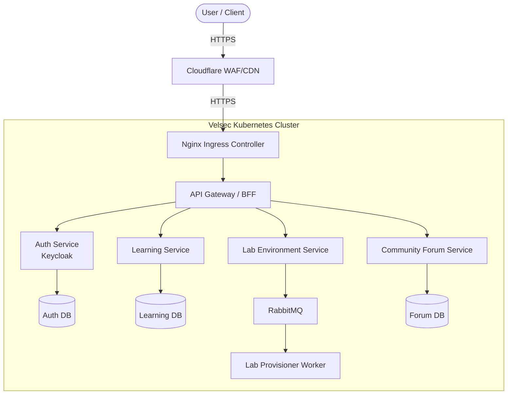
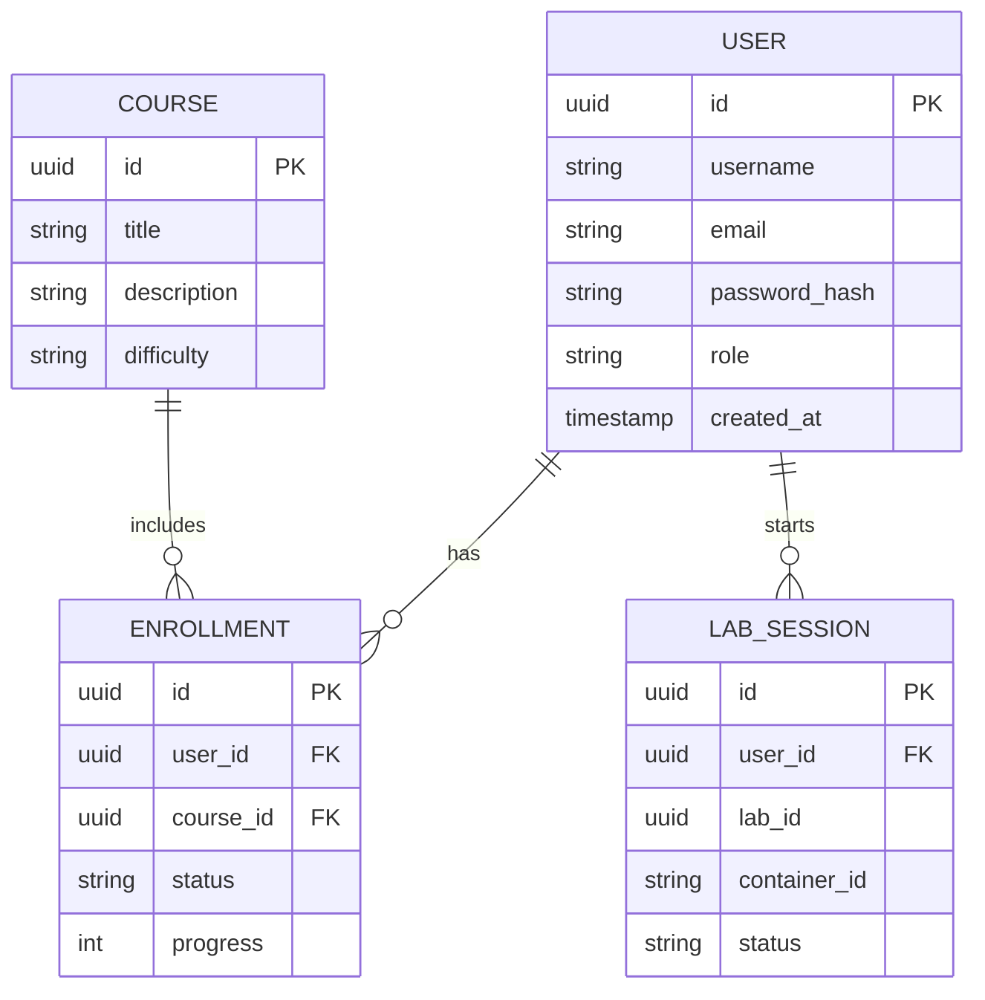
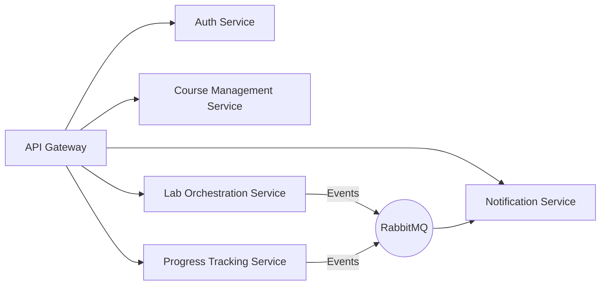
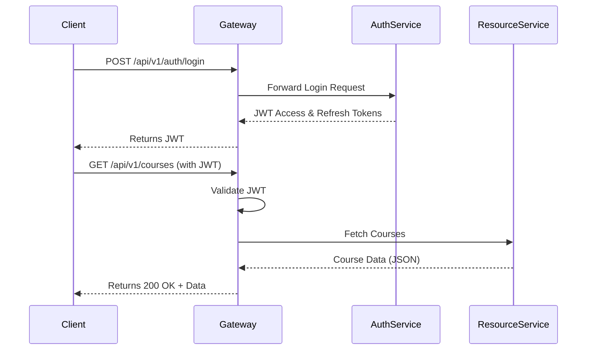
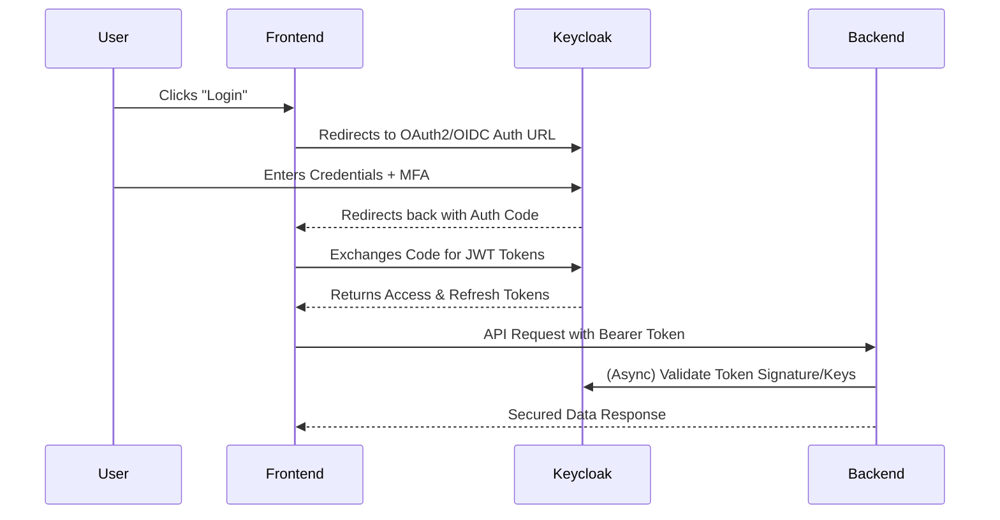
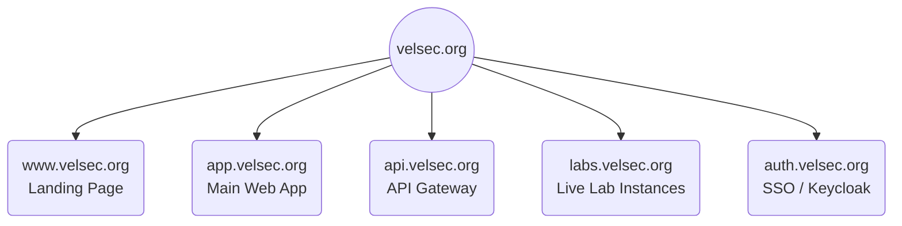
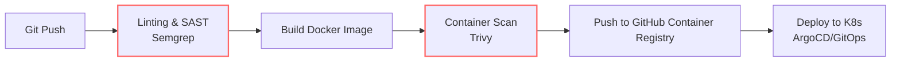
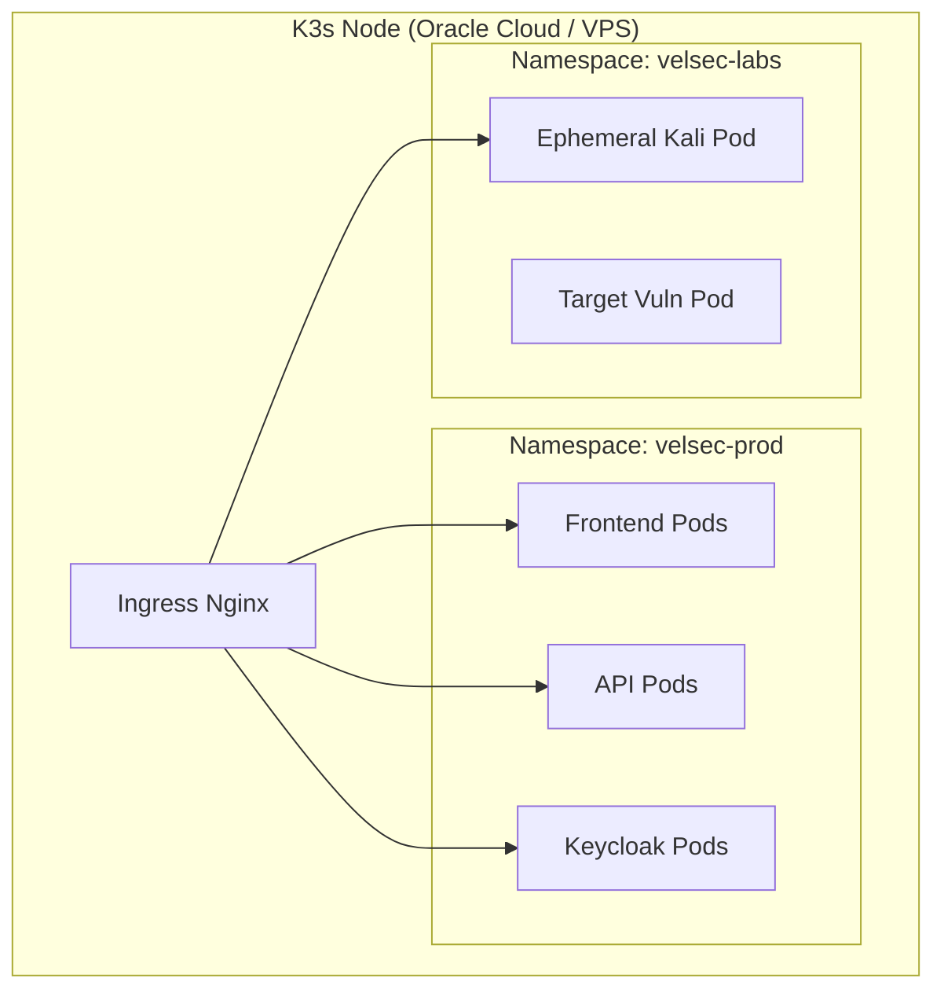
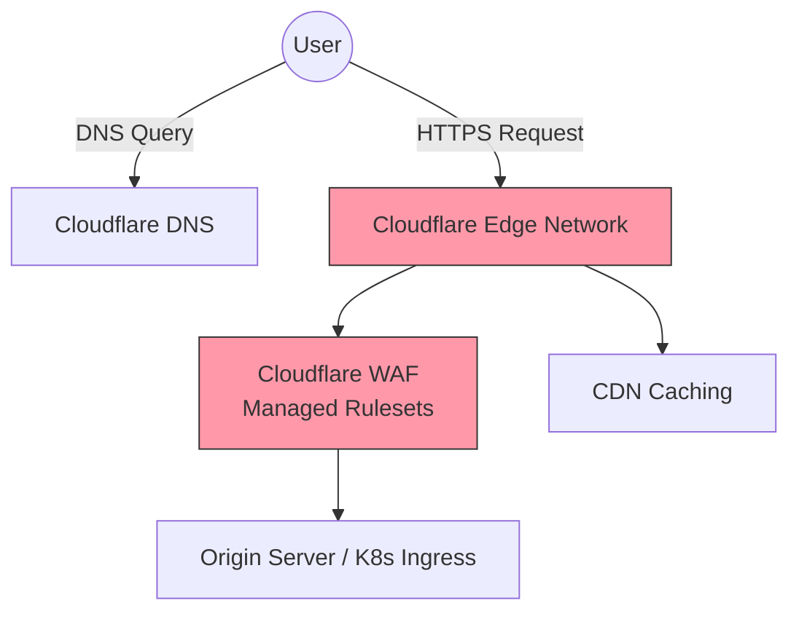

# Velsec Architecture Design
## Ultimate Cybersecurity Learning and Solutions Ecosystem

This document outlines the high-level architecture, security controls, and infrastructure design for Velsec, optimized for free-tier cloud environments using free and open-source software (FOSS).

## 1. System Architecture

The core architecture follows a scalable, event-driven microservices pattern.



## 2. Database Design

Using a mix of PostgreSQL for relational data and Redis for caching.



## 3. Microservices Design

Each service is decoupled, managing its own domain and database to ensure scalability and fault tolerance.



## 4. API Structure

The API is RESTful with potential GraphQL endpoints for complex querying.



- `api.velsec.org/v1/auth/*` - Identity & Access Management
- `api.velsec.org/v1/learn/*` - Curriculum, courses, content delivery
- `api.velsec.org/v1/labs/*` - Ephemeral cybersecurity lab management
- `api.velsec.org/v1/users/*` - Profiles, settings, progression

## 5. Security Controls

- **Edge Security:** Cloudflare WAF (Free Tier), DDoS Protection, strict SSL/TLS (Strict Mode).
- **Application Security:**
  - Input Validation & Sanitization (OWASP recommendations).
  - Rate Limiting at the API Gateway.
  - JWT for stateless authentication; short-lived access tokens, HTTP-only secure cookies for refresh tokens.
  - CORS policies explicitly defined per environment.
- **Infrastructure Security:**
  - Container images scanned via Trivy during CI.
  - Least privilege IAM roles in Kubernetes (RBAC).
  - Network Policies in Kubernetes to restrict namespace communication.
  - Secrets managed via SOPS / Kubernetes Sealed Secrets (no plain text in git).

## 6. User Roles

| Role Name | Access Level | Description |
| :--- | :--- | :--- |
| **Guest** | Read-only | Can view public courses, forums, and marketing pages. |
| **Student** | Standard User | Can enroll in courses, spawn free-tier labs, post in forums. |
| **Pro User** | Premium User | Access to advanced labs, certification paths, priority support. |
| **Instructor** | Content Creator | Can create/edit courses, view student progress, moderate discussions. |
| **Admin** | Superuser | Full system access, user management, infrastructure logs. |

## 7. Authentication Design

Delegated authentication leveraging an open-source Identity Provider like Keycloak.



## 8. Multi-subdomain Architecture

Segregation of duties across subdomains mapped via Cloudflare and Nginx Ingress.



## 9. DevSecOps Pipeline

Automated zero-trust CI/CD using GitHub Actions.



## 10. Kubernetes Deployment Architecture

Lightweight Kubernetes (K3s) deployment suitable for free-tier / minimal infrastructure (e.g., Oracle Cloud Free Tier ARM instances).



## 11. Cloudflare Integration

Leveraging free Cloudflare features to protect and accelerate the ecosystem.



## 12. GitHub Repository Structure

A monorepo structure initially, optimizing for developer velocity, later split if necessary.

```text
velsec-org/
├── .github/
│   ├── workflows/             # CI/CD Pipelines (Build, Test, Scan, Deploy)
│   └── CODEOWNERS
├── architecture/              # Architecture diagrams & documentation
├── apps/                      
│   ├── web-client/            # Next.js Frontend Application
│   ├── api-gateway/           # Express/FastAPI Edge Gateway
│   └── admin-dashboard/       # Internal tool for staff
├── packages/                  # Shared libraries
│   ├── ui-components/         # Reusable React components
│   ├── common-types/          # Shared TypeScript interfaces
│   └── security-utils/        # Shared encryption/auth utilities
├── services/                  # Microservices
│   ├── auth-service/          # Keycloak custom themes / extensions
│   ├── learning-service/      # Core course management backend
│   └── lab-service/           # Kubernetes operator / provisioner
├── infrastructure/            # Infrastructure as Code (IaC)
│   ├── kubernetes/            # Kubernetes manifests & Helm charts
│   ├── terraform/             # Cloud provisioning FOSS scripts
│   └── cloudflare/            # Cloudflare rules config
├── scripts/                   # Local dev setup and utility scripts
├── .gitignore
├── README.md                  # Project overview and getting started
└── docker-compose.yml         # Local development environment
```
