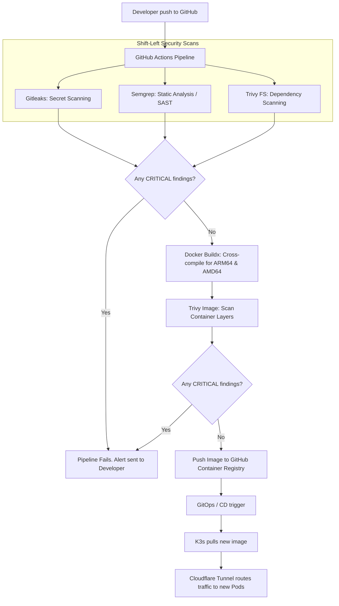

# Velsec Master Roadmap & DevSecOps Strategy

This document serves as the comprehensive master record of the Velsec project. It details the work completed to date, the end-to-end technical workflows, cost estimations for cloud migration, and a strategic roadmap for future development.

---

## 1. Accomplished Work (Phases 1 - 4)

We have successfully established the foundational ecosystem for Velsec across four major phases:

### Phase 1: Architecture & Repository Scaffold
- **System Design:** Established a Modular Monolith architecture pattern to simplify initial deployments while keeping domain logic (Learning, Tracking, Notes, Projects) strictly separated.
- **Repository Structure:** Scaffolded a scalable monorepo environment (`frontend/`, `backend/`, `infrastructure/`).

### Phase 2: Frontend Engineering (3D Cyberpunk Aesthetic)
- **Tech Stack:** Next.js 15 (App Router), React 19, TypeScript, Tailwind CSS v4, React Three Fiber.
- **Achievements:**
  - Implemented dynamic subdomain routing (`velsec.com`, `learn.velsec.com`, etc.) managed natively via Next.js middleware/proxy.
  - Built interactive 3D visual elements (`CyberGlobe`, `DataMesh`) for an immersive "hacker" aesthetic.
  - Configured dark-mode glassmorphism UI with neon green/cyber blue accents.

### Phase 3: Backend Engineering
- **Tech Stack:** FastAPI, Python 3.13, Pydantic, Supabase (PostgreSQL + Auth), Redis.
- **Achievements:**
  - Integrated Supabase JWT validation using dependency injection for seamless RBAC (Role-Based Access Control).
  - Scaffolded domain-driven API routers for tracking threat actors, managing courses, and syncing pentesting notes.
  - Prepared asynchronous Redis caching modules to optimize heavy data reads.

### Phase 4: DevSecOps & Automation
- **Tech Stack:** GitHub Actions, Docker, Trivy, Semgrep, Gitleaks, Kubernetes (K3s), Terraform, Cloudflare.
- **Achievements:**
  - Built multi-stage, multi-architecture (ARM64) Dockerfiles.
  - Implemented a strict "Shift-Left" CI/CD pipeline that immediately fails upon detecting critical CVEs or hardcoded secrets.
  - Drafted K3s manifests and Terraform Cloudflare configurations to securely route traffic to a local Raspberry Pi without opening router ports.

---

## 2. End-to-End DevSecOps Workflow

This is the exact lifecycle of a code change in Velsec, from developer machine to production:

---

## 3. DevSecOps Implementation Guide & Suggestions

To fully realize the automated pipeline drafted in Phase 4, you must configure the following in your environment:

1. **GitHub Secrets:** Ensure `GITHUB_TOKEN` has `write:packages` permissions to push Docker images to the GHCR.
2. **Strict Gating:** Keep Trivy configured to `--exit-code 1` on `CRITICAL`. Do not bypass this, as an exposed cybersecurity education platform is a prime target for real threat actors.
3. **Cloudflare Zero Trust:** 
   - Deploy `cloudflared` on your Raspberry Pi.
   - Run `cloudflared tunnel login` to authenticate.
   - Use Terraform to bind your domains (`*.velsec.com`) to the tunnel. This completely hides your home network's IP address and provides free DDoS protection.

---

## 4. Hosting Cost Estimates & Strategies

While you are currently utilizing a **Raspberry Pi (On-Prem)**, as user traffic scales, you will eventually need to migrate to the cloud. Here is a cost breakdown comparing providers:

### Option A: The "Absolute Zero-Cost" Stack (Current Goal)
- **Compute:** Raspberry Pi (On-Prem) = **$0/mo** (excluding minor electricity).
- **Alternative Compute:** Oracle Cloud Free Tier (Up to 4 ARM Ampere A1 Compute instances with 24GB RAM) = **$0/mo**. *(Highly Recommended if you outgrow the Pi)*.
- **Database / Auth:** Supabase Free Tier (500MB DB, 50k MAU) = **$0/mo**.
- **Ingress / WAF / DNS:** Cloudflare Free Tier = **$0/mo**.
- **Registry / CI-CD:** GitHub Actions & GHCR = **$0/mo**.
- **Total:** **$0/mo** 

### Option B: Budget Cloud Providers (Hetzner / DigitalOcean / Linode)
Once traffic exceeds the capacity of a single Pi or Oracle's free tier:
- **Compute (K3s Cluster):** 3x Hetzner ARM64 Nodes (4 Cores, 8GB RAM each) = **~$15/mo** total.
- **Managed Database:** DigitalOcean Managed PostgreSQL = **$15/mo**.
- **Total:** **~$30/mo** for an incredibly powerful, highly-available enterprise-grade cluster.

### Option C: AWS / Enterprise Cloud (Not Recommended for Startups)
- **Compute (EKS):** Amazon EKS Control Plane = ~$73/mo + EC2 Worker Nodes (~$40/mo) = **~$113/mo**.
- **Database (RDS):** Minimum production RDS instance = **~$30 - $60/mo**.
- **Network (ALB/Nat Gateway):** **~$40/mo**.
- **Total:** **~$200+/mo**. 
> [!TIP]
> **Suggestion:** Avoid AWS/GCP until Velsec has strong revenue. Stick to your Raspberry Pi, and migrate to Oracle Cloud Free Tier or Hetzner when you need absolute reliability.

---

## 5. Future Development Roadmap

### Phase 5: Core Feature Implementation
- [ ] **Auth Flow Integration:** Connect the frontend Next.js forms to the Supabase backend APIs to finalize user registration and login.
- [ ] **Content Management System (CMS):** Build out the admin panel on the frontend to allow Velsec instructors to upload markdown files for the `learn` and `notes` platforms.

### Phase 6: Telemetry, Observability & Analytics
- [ ] **Prometheus & Grafana:** Deploy observability stacks to your Raspberry Pi to monitor RAM/CPU usage and API request latency.
- [ ] **Centralized Logging:** Implement ELK stack (Elasticsearch, Logstash, Kibana) or Loki to aggregate FastAPI logs.

### Phase 7: Advanced Security Emulation (Lab Environments)
- [ ] **Dynamic Lab Provisioning:** Automate the spinning up of vulnerable Docker containers for users to practice hacking on `projects.velsec.com`.
- [ ] **VPN/Wireguard Integration:** Allow users to VPN into the Velsec isolated lab networks (similar to HackTheBox).

### Phase 8: Gamification & Community
- [ ] **Leaderboards & Badges:** Track user progress across courses and display real-time global leaderboards.
- [ ] **Discord / Matrix Integration:** Build bots to announce when a user completes a major security milestone.
