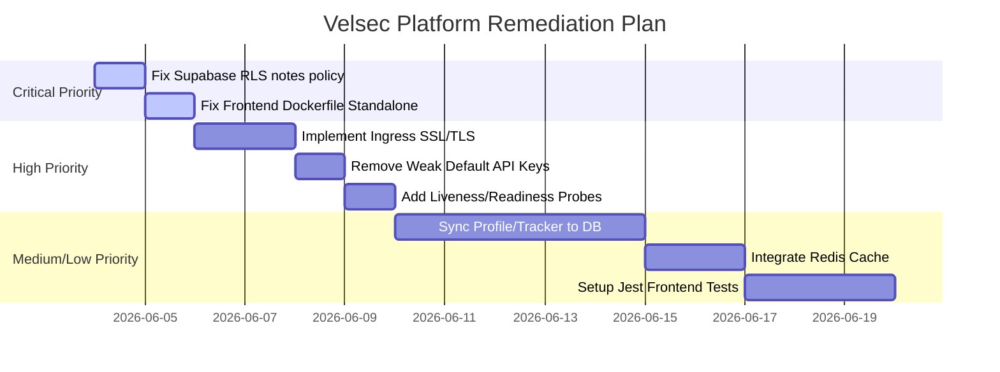

# Velsec Comprehensive Testing, Security Review & Quality Assessment Report

This report provides an enterprise-grade evaluation of the Velsec Cybersecurity Ecosystem. It identifies critical security vulnerabilities, functional defects, SRE performance bottlenecks, and architectural issues across the codebase.

---

## 1. Executive Summary

The Velsec platform presents a highly polished, visual cyberpunk terminal theme on the frontend, but faces significant security, architectural, and operational gaps that prevent it from being production-ready.

* **Security Posture (Score: 45/100):** Multiple critical and high vulnerabilities were discovered. The most severe is a **Supabase RLS Bypass** on the `notes` table, allowing anonymous extraction of sensitive SecOps dossiers directly from the browser. Additionally, there is a total lack of SSL/TLS configuration in Kubernetes ingress manifests, and the backend relies on weak development default keys.
* **Code & Quality Control (Score: 50/100):** Frontend code has **0% unit/E2E test coverage**. Several core features (the Progress Tracker, Skill Matrix, and News Feeds) are entirely simulated on the client-side using ephemeral React state, meaning no data is saved on reload. A critical configuration defect prevents the frontend Docker container from compiling.
* **Production Readiness (Score: 35/100):** Kubernetes configurations lack health probes (liveness/readiness), run all pods with a single replica (no high availability), and do not define any Pod Security Context. The local developer setup (`docker-compose.yml`) is completely empty.

---

## 2. Risk Matrix

| Finding ID | Finding Title | Component | Severity | Impact | Status |
| :--- | :--- | :--- | :--- | :--- | :--- |
| **SEC-01** | Permissive Supabase RLS Policy on Notes Table | Supabase (Database) | **CRITICAL** | Complete data leak of sensitive SecOps runbooks | Open |
| **SEC-02** | Weak/Default API Keys for Notes Syncing | Backend (FastAPI) | **HIGH** | Unauthorized note injection/corruption | Open |
| **SEC-03** | Missing Ingress SSL/TLS in Kubernetes | Infrastructure (k8s) | **HIGH** | Session hijacking / Cleartext transmission | Open |
| **SEC-04** | Absent Pod Security Context (Root Containers) | Infrastructure (k8s) | **MEDIUM** | Sandbox escape / Privilege escalation | Open |
| **SEC-05** | Weak Fallback Secrets in Backend config.py | Backend (FastAPI) | **MEDIUM** | Authentication bypass via signature forging | Open |
| **QA-01** | Broken Docker Build (Next.js Standalone Mode) | Frontend (Next.js) | **CRITICAL** | Image compilation failure in CI/CD | Open |
| **QA-02** | Ephemeral Client-Side State for Tracker & Profile | Frontend (Next.js) | **HIGH** | Progress data loss on page refresh | Open |
| **QA-03** | 0% Frontend Test Coverage | Frontend (Next.js) | **HIGH** | Regressions and undetected runtime bugs | Open |
| **QA-04** | Empty Boilerplate Folders / Repo Clutter | Repository | **LOW** | Developer confusion / Technical debt | Open |
| **SRE-01** | Missing Liveness and Readiness Probes | Infrastructure (k8s) | **HIGH** | Unhealthy container routing / Outages | Open |
| **SRE-02** | Zero High-Availability (1 Replica) | Infrastructure (k8s) | **MEDIUM** | Single point of failure (SPOF) | Open |
| **SRE-03** | Dead Redis Caching Layer | Backend (FastAPI) | **MEDIUM** | High database load / Slow queries | Open |
| **SRE-04** | PyJWT / python-jose Dependency Conflict | Backend (FastAPI) | **MEDIUM** | Backend runtime failure / Crash | Open |

---

## 3. Detailed Security Findings (SAST, DAST, IaC)

### SEC-01: Permissive Supabase RLS Policy on Notes Table
* **Severity:** **CRITICAL**
* **Impact:** Any user or attacker can read all sensitive incident response runbooks and threat intel dossiers directly from the public database using the public anonymous publishable key, bypassing the login screens entirely.
* **Attack Scenario:** An attacker retrieves the public Supabase publishable key and endpoint from the client bundle. They execute a direct SELECT query against the `notes` table using the Supabase API. Because the RLS policy is `FOR SELECT USING (true)`, all rows are returned unauthenticated.
* **Root Cause:** The `notes_schema.sql` defines:
  ```sql
  CREATE POLICY "Allow public select access to notes" ON public.notes
      FOR SELECT USING (true);
  ```
* **Proof of Concept:**
  ```javascript
  import { createClient } from '@supabase/supabase-js';
  const supabase = createClient('https://ubfkvjzuqvgqrfkunmqx.supabase.co', 'sb_publishable_s9T2KOiy1hsPcOVrISGCfw_Q8jyvHbS');
  const { data } = await supabase.from('notes').select('*');
  console.log(data); // Returns active directory compromised runbooks
  ```
* **Fix Recommendation:** Replace the public policy with one that requires user authentication.
* **Secure Code Fix:**
  ```sql
  -- architecture/notes_schema.sql
  DROP POLICY "Allow public select access to notes" ON public.notes;
  CREATE POLICY "Allow authenticated select access to notes" ON public.notes
      FOR SELECT TO authenticated USING (true);
  ```

### SEC-02: Weak/Default API Keys for Notes Syncing
* **Severity:** **HIGH**
* **Impact:** Unauthenticated attackers can inject fake notes or corrupt existing incident runbooks, misleading security operators.
* **Attack Scenario:** An attacker sends a HTTP POST request to `/api/v1/notes/sync` with `X-Sync-Key: default-sync-key`. The endpoint accepts it and overwrites the contents of the Active Directory Compromise Incident Response Runbook.
* **Root Cause:** The `notes.py` router reads `SYNC_API_KEY` from environment variables but defaults to a guessable string if unset:
  ```python
  expected_key = os.environ.get("SYNC_API_KEY", "default-sync-key")
  ```
* **Proof of Concept:**
  ```bash
  curl -X POST http://localhost:8000/api/v1/notes/sync \
    -H "Content-Type: application/json" \
    -H "X-Sync-Key: default-sync-key" \
    -d '[{"id":"active-directory","title":"Compromised","category":"Runbooks","tags":["AD"],"content":"All servers compromise. Disconnect everything.","last_updated":"2026-06-03"}]'
  ```
* **Fix Recommendation:** Remove default string fallbacks and raise an error on startup if key is not defined.
* **Secure Code Fix:**
  ```python
  # backend/app/api/routers/notes.py
  expected_key = os.environ.get("SYNC_API_KEY")
  if not expected_key:
      raise RuntimeError("SYNC_API_KEY must be set in the production environment variables!")
  ```

### SEC-03: Missing Ingress SSL/TLS in Kubernetes
* **Severity:** **HIGH**
* **Impact:** Cleartext transmission of bearer tokens and credentials, rendering the application vulnerable to Man-in-the-Middle (MitM) attacks.
* **Attack Scenario:** An attacker intercepts traffic on a local Wi-Fi network and reads JWT tokens in cleartext as users navigate `notes.velsec.com` over plain HTTP.
* **Root Cause:** `infrastructure/k8s/ingress.yaml` has no TLS block or middlewares to redirect HTTP to HTTPS.
* **Fix Recommendation:** Integrate cert-manager and configure TLS.
* **Secure Code Fix:**
  ```yaml
  # infrastructure/k8s/ingress.yaml
  spec:
    tls:
    - hosts:
      - velsec.com
      - "*.velsec.com"
      secretName: velsec-tls-secret
  ```

### SEC-04: Absent Pod Security Context in Kubernetes manifests
* **Severity:** **MEDIUM**
* **Impact:** Exploitation of application-level vulns can lead to host container escapes or unauthorized host filesystem writes.
* **Root Cause:** Manifests in `infrastructure/k8s` do not declare a `securityContext` block.
* **Fix Recommendation:** Implement pod security standards (Restricted mode).
* **Secure Code Fix:**
  ```yaml
  # infrastructure/k8s/backend-deployment.yaml
  spec:
    containers:
    - name: backend
      securityContext:
        allowPrivilegeEscalation: false
        readOnlyRootFilesystem: true
        runAsNonRoot: true
        runAsUser: 10001
  ```

### SEC-05: Weak Fallback Secrets in config.py
* **Severity:** **MEDIUM**
* **Impact:** Allows forgery of admin credentials if config variables are left unset in staging/dev environments.
* **Root Cause:** In `backend/app/core/config.py`:
  ```python
  SUPABASE_JWT_SECRET: str = "your-jwt-secret"
  ```
* **Fix Recommendation:** Require the secret to be set in environment without default fallbacks.

---

## 4. Functional Defects & Quality Assessment

### QA-01: Broken Docker Build (Next.js Standalone Mode Config Mismatch)
* **Severity:** **CRITICAL**
* **Impact:** The frontend Docker image cannot be built, breaking CI/CD pipeline deployments.
* **Failure Scenario:** `docker build -t frontend ./frontend` fails with file-not-found errors during stage 2 copy.
* **Root Cause:** `frontend/Dockerfile` copies files from `/app/.next/standalone` but `frontend/next.config.ts` does not have `output: "standalone"` enabled.
* **Fix Recommendation:** Add output option to `next.config.ts`.
* **Secure Code Fix:**
  ```typescript
  // frontend/next.config.ts
  const nextConfig: NextConfig = {
    output: "standalone",
    allowedDevOrigins: [...]
  };
  ```

### QA-02: Ephemeral Client-Side State for Tracker & Profile (Data Loss)
* **Severity:** **HIGH**
* **Impact:** Progress tracking is purely cosmetic and users lose all accomplishments when they refresh their browser.
* **Root Cause:** `tracker/page.tsx` and `personal/page.tsx` manage all operations (training, solving labs, toggling certs) using client-side `useState` hooks. No API endpoints save these updates to PostgreSQL.
* **Fix Recommendation:** Implement backend API endpoints to update user skills and achievements in the database.

### QA-03: 0% Frontend Test Coverage
* **Severity:** **HIGH**
* **Impact:** No automated validation on the frontend, allowing visual regressions or broken state logic to slip into production.
* **Fix Recommendation:** Install Jest and React Testing Library, and write basic validation tests for subdomains.

---

## 5. SRE & Performance Engineering Review

### SRE-01: Missing Liveness and Readiness Probes
* **Severity:** **HIGH**
* **Impact:** Kubernetes might send traffic to uninitialized or dead pods, resulting in service outages.
* **Root Cause:** Absence of health probes in `backend-deployment.yaml` and `frontend-deployment.yaml`.
* **Fix Recommendation:** Add probes pointing to the health endpoints.
* **Secure Code Fix:**
  ```yaml
  # infrastructure/k8s/backend-deployment.yaml
  livenessProbe:
    httpGet:
      path: /health
      port: 8000
    initialDelaySeconds: 5
    periodSeconds: 10
  ```

### SRE-02: Zero High-Availability (1 Replica)
* **Severity:** **MEDIUM**
* **Impact:** Deployment upgrades or node crashes result in immediate service disruption.
* **Fix Recommendation:** Scale to `replicas: 2` and use Horizontal Pod Autoscaler (HPA).

### SRE-03: Dead Redis Caching Layer
* **Severity:** **MEDIUM**
* **Impact:** Database overload due to redundant queries for static threat lists.
* **Root Cause:** `backend/app/core/cache.py` is initialized but never imported or utilized.
* **Fix Recommendation:** Connect the cache service during FastAPI startup and cache courses and note queries.

### SRE-04: PyJWT / python-jose Dependency Conflict
* **Severity:** **MEDIUM**
* **Impact:** Can cause server boot crashes or signature exceptions at runtime.
* **Root Cause:** Both packages are declared in `requirements.txt`. They declare the same namespace `jwt` and override each other.
* **Fix Recommendation:** Remove `python-jose` and standardize JWT decoding via `PyJWT`.

---

## 6. DevSecOps Maturity Assessment

* **SAST (Gitleaks, Semgrep, Trivy):** Excellent step configured in `.github/workflows/devsecops-pipeline.yml` to trigger on pushes.
* **DAST (OWASP ZAP):** Not configured. DAST scanner must be integrated into the deployment staging gate.
* **Container Scanning:** Configured via Trivy in GitHub Actions.
* **Secret Management:** Gaps identified—secrets default to configuration files. Recommend Kubernetes Sealed Secrets or AWS Secrets Manager.

---

## 7. Remediation Roadmap



### Production Readiness Score Summary

* **Production Readiness Score:** **35/100**
* **Security Score:** **45/100**
* **Quality Score:** **50/100**
